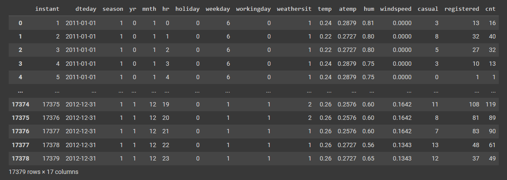

**Table of Contents**

- [Data quality analysis](#data-quality-analysis)
- [Data taxonomy](#data-taxonomy)
- [Descriptive statistics](#descriptive-statistics)
    - [Basic definitions](#basic-definitions)
- [Pandas and Python 101](#pandas-and-python-101)
    - [Basic concepts](#basic-concepts)
    - [Basic panda commands](#basic-panda-commands)


# Data quality analysis

You can consider a number of parameters to analyze the qualify of the data possessed, such as the following:

- The data source reliability;
- Precision of the data;
- Accessibility / availability of the data;
- Security and privacy of the data;
- Data richness;
- Consistency, organization of the data;
- Data relevancy (If it still applies for the current time and if it applies for the current study);
- Granularity: The amount of detail;

# Data taxonomy

Data can be categorized as the following:

- Structured:
    - Categorical: Non numerical measures used to describe things or people;
        - Nominal: Can't be ordered (Sex, ethnicity, civil state...);
        - Ordinal: Can be ordered (Age, height, schooling...);
    - Numerical: Numerical values for specific variables;
        - Intervals: Relative to a certain measurement without an absolute zero;
        - Rational: Has absolute zero;
- Semi-structured or Non-structured:
    - Textual;
    - Multimedia;
        - Image;
        - Video;
        - Audio;
    - XML/JSON;

# Descriptive statistics

## Basic definitions

- Population: Set of units that share something in common and are analyzed for a study;
- Sample: Part of the population that can be analyzed by itself;
- Variable: a certain characteristic in common between units of the population;

**_Note:_** Variables are **quantitative** if they can be ordered in a numeric scale and **qualitative** if they can't;

# Pandas and Python 101

## Basic concepts

- Data frame: Table that contains data and methods that can be used to manipulate that data

## Basic panda commands

First of all it's important to import the library to actually make full use of panda's tools
```python
import pandas as pd
```

1. Loading tables into pandas
   
    ```python
    df = pd.read_csv('enter your csv path here')
    ```
    Here's an example of a table that has just been imported:
    

2. Taking samples of tables
   
    To take samples of tables there are lots of commands that let you separate what you need from what you don't;
    - `.head(n)` and `tail(n)` method let's you view the first or last 'n' rows from the table respectively;
    - `.column_name` and `['column_name']` methods let's you view the rows from the 'column_name' column, you can also pass lists as parameters in the second method as per shown: `[['column_1', 'column_2']]`;
    - `.iloc[m, n]` can select the cell/sample wanted in the 'm' row and 'n' column, tou can also pass intervals as parameters as per shown: `.iloc[4:, -5:]`;
    - `.query('condition')` method allows you to filter content using the 'condition' conditional;

3. Adding to the table

    You can create new columns, rows and modify cells in the table;
    - `['new_column']` creates the 'new_column' column in the table. You can also create new columns based on the data contained in the old ones as per shown: `['new_column'] = df['column_a'] + df['column_b']`