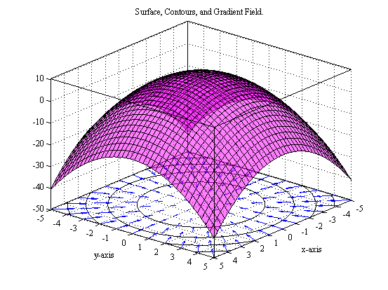

# Gradient vectors

A gradient vector of a function is vector whose direction points at the greatest increase in that function and it's magnitude is equivalent to the rate of change of that same function on when changing the input in that direction;

$$
\nabla f = \begin{bmatrix}
    f_x\\
    f_y\\
    \text{...}
\end{bmatrix};\, f(x,\,y,\,\text{...})
$$
$$
\footnotesize{
    \begin{array}{c}
        \nabla f \text{: gradient vector of }f
    \end{array}
}
$$

## Computing the tangent plane to a point in a function

# Directional derivatives

The directional derivative is used to find the rate of change in the function's output when changing the input from a specific point in the direction of a vector;

$$
\nabla_v f(a,\,b) = \nabla f(a,\,b) \cdot \frac{\vec{v}}{||\vec{v}||}
$$
$$
\footnotesize{
    \begin{array}{cc}
        \nabla_v f(a,\,b) \text{: Directional derivative of $f$ at the point $(a,\,b)$ in the direction of $\vec{v}$.}\\
        ||\vec{v}|| \text{: magnitude of $\vec{v}$.}
    \end{array}
}
$$

**_Note:_** The magnitude of a vector is equivalent to:

$$
||\vec{v}|| = \sqrt{v_x^2+v_y^2+v_z^2+\text{...}}
$$

**_Note:_** Given the angle $\theta$ of the direction of $\nabla_v f(a,\,b)$, the unit vector of $\vec{v}$ $\left(\frac{\vec{v}}{||\vec{v}||}\right)$ is:

$$
\vec{u} = 
\begin{bmatrix}
    \cos(\theta)\\
    \sin(\theta)
\end{bmatrix}
$$