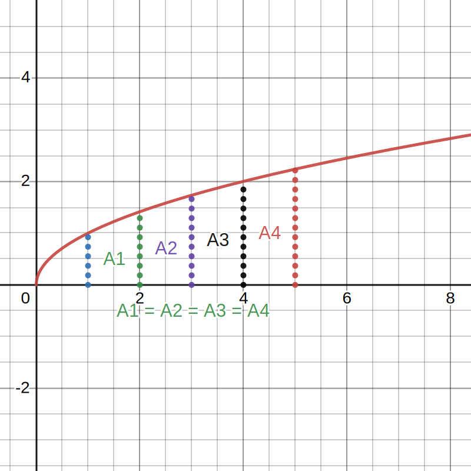

**Table of Contents**

- [Linear Regression](#linear-regression)
    - [Finding the regression line using a matrix approach](#finding-the-regression-line-using-a-matrix-approach)
- [\\end{bmatrix}](#endbmatrix)
- [\\end{bmatrix}](#endbmatrix-1)
- [\\end{bmatrix}](#endbmatrix-2)
    - [Calculating the residual sum of squares](#calculating-the-residual-sum-of-squares)
- [Numerical integration](#numerical-integration)
    - [Newton-Cotes method](#newton-cotes-method)

# Linear Regression

## Finding the regression line using a matrix approach

| x_i  | \| | y_i  |
|-|-|-|
|x_1|\||y_1|
|x_2|\||y_2|
|...|\||...|
|x_n|\||y_n|

By using the values in the table you can create a linear system with all the equations;

$$
d + x_i\cdot c = y_i \implies
\begin{bmatrix}
1 & x_1 \\
1 & x_2 \\
... & ... \\
1 & x_n \\
\end{bmatrix}
\cdot
\begin{bmatrix}
d \\
c \\
\end{bmatrix}
=
\begin{bmatrix}
y_1 \\
y_2 \\
... \\
y_n
\end{bmatrix}
$$

To solve the system using the inversion method we need to invert the coefficient matrix. Because we need a square matrix to find it's inverted form, we can multiply both sides of the equation by the transposed coefficient matrix.

$$
\begin{bmatrix}
1 & 1 & ... & 1 \\
x_1 & x_2 & ... & x_n \\
\end{bmatrix}
\begin{bmatrix}
1 & x_1 \\
1 & x_2 \\
... & ... \\
1 & x_n \\
\end{bmatrix}
\cdot
\begin{bmatrix}
d \\
c \\
\end{bmatrix}
=
\begin{bmatrix}
1 & 1 & ... & 1 \\
x_1 & x_2 & ... & x_n \\
\end{bmatrix}
\cdot
\begin{bmatrix}
y_1 \\
y_2 \\
... \\
y_n
\end{bmatrix}
$$

Now we can solve for $\mathbf{d}$ and $\mathbf{c}$ using the inversion method:

$$
\begin{bmatrix}
d \\
c \\
\end{bmatrix}
=
\left(\begin{bmatrix}
1 & 1 & ... & 1 \\
x_1 & x_2 & ... & x_n \\
\end{bmatrix}
\begin{bmatrix}
1 & x_1 \\
1 & x_2 \\
... & ... \\
1 & x_n \\
\end{bmatrix}\right)^{-1}
\cdot
\begin{bmatrix}
1 & 1 & ... & 1 \\
x_1 & x_2 & ... & x_n \\
\end{bmatrix}
\cdot
\begin{bmatrix}
y_1 \\
y_2 \\
... \\
y_n
\end{bmatrix}
$$

Generalizing, the formula for finding the coefficients of the regression line can be represented as:

$$
x = (A^T\cdot A)^{-1}\cdot A^T\cdot b
$$

**_Note:_** $(A^T\cdot A)^{-1}\cdot A^T$ is called the **pseudo-inverse** of the matrix $A$;

## Calculating the residual sum of squares 

After finding the regression line, we can measure the quality of the adjustment by calculating the **residual sum of squares**. The smaller the number, the better is the regression line represented;

$$
RSS = \sum_{i=1}^{n}(y_i-\hat{y}_i)^2
$$
$$
\small{
    \hat y_i \rightarrow \text{Predicted value (From regression line)}
}
$$
$$
\small{
    y_i \rightarrow \text{Real value}
}
$$

# Numerical integration

## Newton-Cotes method

To explain the method, an example will be used to illustrate the process

$$
\text{Solve the definite integral below using the Newton-Cotes method of order 4 and explicit the relative error}
$$
$$
\int_1^5f(x);\,f(x)=\sqrt{x}
$$

1. Divide the interval stated in the definite integral into $n$ equal parts ($n$ being the order of the method, in this case $n=4$)

2. Find the sum of the ordinates of the points that divide the parts using the function $f(x)$ multiplied by their respective weights (Defined by the order of the method used). The approximated value of the definite integral will be that value multiplied by the interval of the integral;

$$
S = \{1, 2, 3, 4, 5\}
$$
$$
\int_1^5\sqrt{x}\approx (5-1)\cdot \sum_{i=0}^4 f(S_i)\cdot w_i \approx 6.7863 \implies e_{rel}=
$$