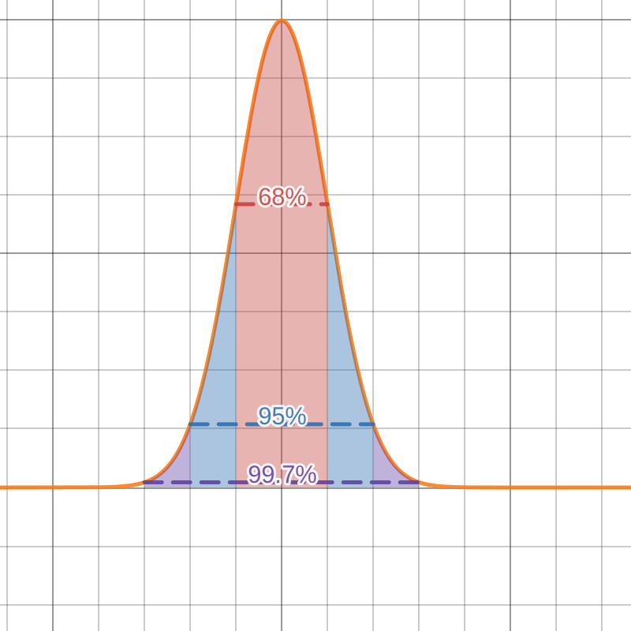

**Table of Contents**

- [Normal distribution](#normal-distribution)
  - [Z-Score](#z-score)
  - [Empirical rule](#empirical-rule)
- [Linear regression](#linear-regression)
  - [Finding regression line using the matricial approach](#finding-regression-line-using-the-matricial-approach)
  - [Check accuracy of the regression line](#check-accuracy-of-the-regression-line)

# Normal distribution

## Z-Score

The Z-Score represents the number of standard deviations a data point is from the mean of the population;

$$
z = \frac{x - \mu}{\sigma}
$$

## Empirical rule

If the data points of a population follow a normal distribution, the probability of them being between some intervals follows a certain pattern

# Linear regression

## Finding regression line using the matricial approach

$$
\hat{y} = c \cdot x + d
$$

You can represent the regression line with by the $A$ matrix below (Coefficients $c$ and $d$), the $X$ and $Y$ matrices represent the set of points to be regressed;

$$
A = \begin{bmatrix}
    c \\
    d \\ 
\end{bmatrix}
\,
X = \begin{bmatrix}
  x_1 \\
  x_2 \\
  x_3 \\
  \text{...}\\
  x_n
\end{bmatrix}
\,
Y = \begin{bmatrix}
  y_1 \\
  y_2 \\
  y_3 \\
  \text{...}\\
  y_n
\end{bmatrix}
$$

To find the coefficients, you can use the equation below:

$$
A = \left((X^T \cdot X)^{-1} \cdot X^T\right) \cdot Y
$$

**_Note:_**$\left((X^T \cdot X)^{-1} \cdot X^T\right)$ is called the **pseudo-inverse** of matrix $X$;

## Check accuracy of the regression line

To check how well the regression line calculated represents the set of points, you can you the **residual sum of squares** $(\text{RSS})$

$$
\text{RSS} = \sum_{i=1}^{n}(y_i - \hat{y}_i)^2
$$

The lower the value of the $\text{RSS}$, the closer to the regression line is to represent the set of points;

> $RSS = 0$ (Perfect fit)

> $RSS > 0$ (Best possible fit)