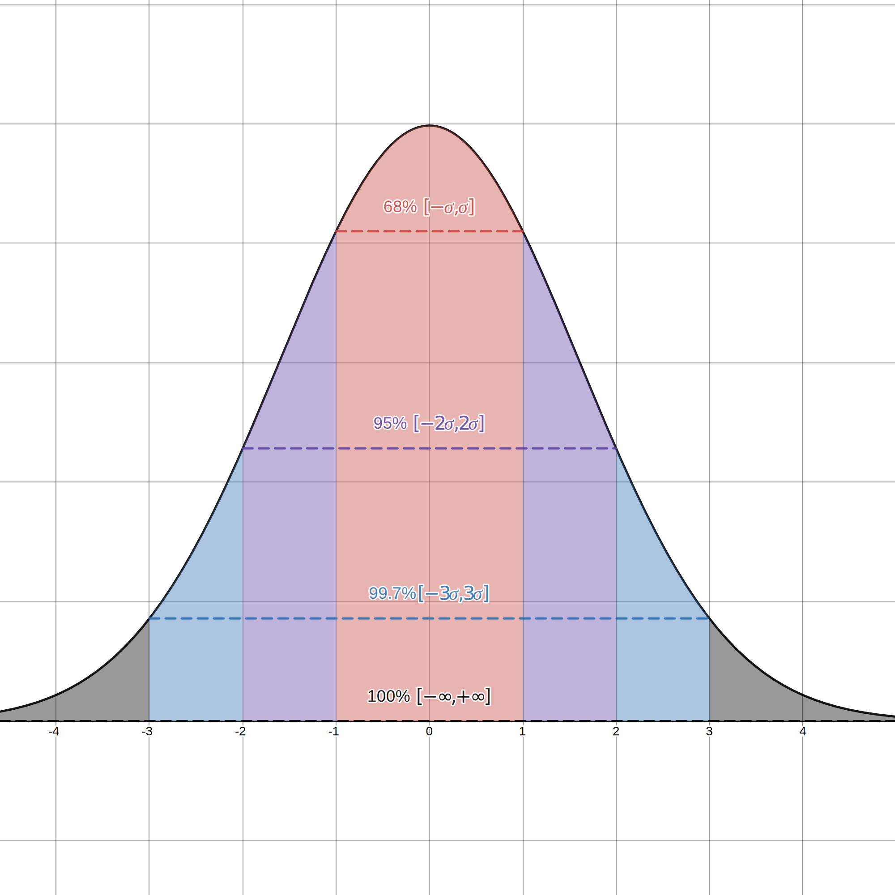
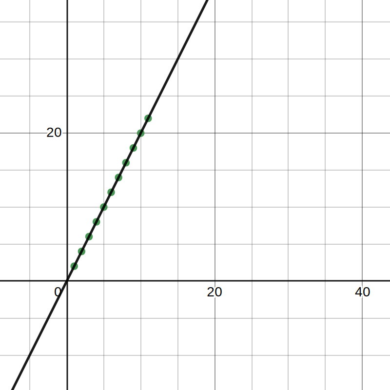
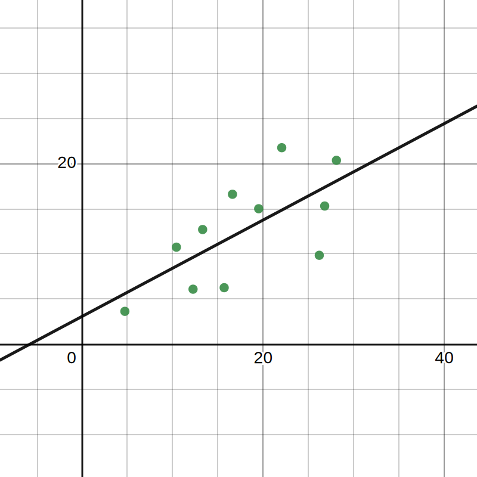

**Table of Contents**

- [Normal distribution](#normal-distribution)
  - [Z-Score](#z-score)
  - [Empirical rule](#empirical-rule)
- [Sampling distribution](#sampling-distribution)
  - [Sample elements](#sample-elements)
  - [Central limit theorem](#central-limit-theorem)
- [Linear regression](#linear-regression)
  - [Finding regression line using the matricial approach](#finding-regression-line-using-the-matricial-approach)
  - [Check accuracy of the regression line](#check-accuracy-of-the-regression-line)
- [Testing hypothesis](#testing-hypothesis)

# Normal distribution

## Z-Score

The Z-Score represents the number of standard deviations a data point is from the mean of the population;

$$
z = \frac{x - \mu}{\sigma}
$$

## Empirical rule

If the data points of a population follow a normal distribution, the probability of them being between some intervals follows a certain pattern

# Sampling distribution

Running statistics on samples can differ from statistics in the population, so there are some techniques to make the analysis more accurate;

## Sample elements

$$
S_i = \{a_1, a_2, ..., a_n\} \rightarrow \text{Set of $n$ samples from the population}
$$
$$
\bar{x_i} \rightarrow \text{Mean of the sample set}
$$
$$
\bar{X} \rightarrow \text{Random variable from the sample}
$$

## Central limit theorem

As the number $(i)$ of sample sets increases, the means of those sets $(\bar{x}_i)$ tend to form a normal distribution (despite of the distribution nature of the variable that the sample represents). The mean of that distribution formed (Sampling distribution of the sample means) is equivalent the mean of the population $(\mu)$. The greater the number of elements $(n)$ in each sample, the lesser the standard deviation of that formed distribution; 

# Linear regression

## Finding regression line using the matricial approach

$$
\hat{y} = c \cdot x + d
$$

You can represent the regression line with by the $A$ matrix below (Coefficients $c$ and $d$), the $X$ and $Y$ matrices represent the set of points to be regressed;

$$
A = \begin{bmatrix}
    d \\
    c \\ 
\end{bmatrix}
\,
X = \begin{bmatrix}
  1 & x_1 \\
  1 & x_2 \\
  1 & x_3 \\
  \text{...} & \text{...}\\
  1 & x_n
\end{bmatrix}
\,
Y = \begin{bmatrix}
  y_1 \\
  y_2 \\
  y_3 \\
  \text{...}\\
  y_n
\end{bmatrix}
$$

To find the coefficients, you can use the equation below:

$$
A = \left((X^T \cdot X)^{-1} \cdot X^T\right) \cdot Y
$$

**_Note:_**$\left((X^T \cdot X)^{-1} \cdot X^T\right)$ is called the **pseudo-inverse** of matrix $X$;

## Check accuracy of the regression line

To check how well the regression line calculated represents the set of points, you can you the **residual sum of squares** $(\text{RSS})$

$$
\text{RSS} = \sum_{i=1}^{n}(y_i - \hat{y}_i)^2
$$

The lower the value of the $\text{RSS}$, the closer to the regression line is to represent the set of points;

> $RSS = 0$ (Perfect fit)

> $RSS > 0$ (Best possible fit)

# Testing hypothesis

Hypothesis always come in a tuple of two elements $\{H_0, H_1\}$. $H_0$ affirm an equality about a variable or a defined interval of where it stands. $H_1$, on the other hand, refutes $H_0$ with an inequality;

$$
z = \frac{\bar{x}-\mu}{\frac{s}{\sqrt{n}}}
$$

**_Ex.:_** A transport company is calculating the mean time that the traffic lights stay red in the region, they collected 40 samples ($n$) in which the mean was $10s$ ($\bar{x}$) with a standard deviation of $1.5s$, what can be affirmed about the hypothesis below with a significance level of $5\%$ and of $2\%$?
$$
H_0: \mu = 10.5s
$$
$$
H_1: \mu \neq 10.5s
$$

To solve the example above, one needs to determine the critic zone (The outside of the trust zone) in which the mean needs to be to confirm $H_1$;

$$
z = \frac{10-10.5}{\frac{1.5}{\sqrt{40}}} \approx -2.1
$$
$$
\text{Case 1: Significance level of $5\%$}
$$
$$
Pr(Z<Z_{cr}) = 2.5\% \implies Z_{cr} = 1.96\%
$$
$$
Pr(-Z<-Z_{cr}) = 2.5\% \implies -Z_{cr} = -1.96\%
$$
$$
z \in [\,0,-Z_{cr}\,] \cup [\,Z_{cr}, +\infty\,[
\implies
\begin{cases}
  H_1 = \text{True}\\
  H_0 = \text{False}\\
\end{cases}
$$
$$
\text{Case 2: Significance level of $1\%$}
$$
$$
Pr(Z<Z_{cr}) = 0.5\% \implies Z_{cr} = 2.58\%
$$
$$
Pr(-Z<-Z_{cr}) = 0.5\% \implies -Z_{cr} = -2.58\%
$$
$$
z \notin [\,0,-Z_{cr}\,] \cup [\,Z_{cr}, +\infty\,[
\implies \text{No conclusions to be made}
$$