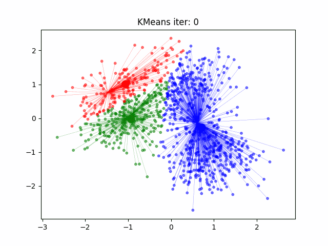
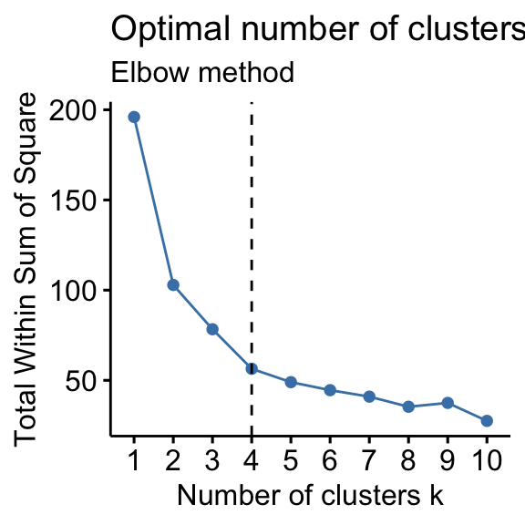

**Table of Contents**

- [Introduction to unsupervised learning](#introduction-to-unsupervised-learning)
    - [Used techniques](#used-techniques)
        - [Clustering](#clustering)
            - [K-Means](#k-means)

# Introduction to unsupervised learning

Unsupervised learning is when the machine learning algorithm receives the input data and it's function is to detect patterns that can relate objects;

## Used techniques

### Clustering

When clustering data, the objects are separated in clusters (groups) in which every object is the closest representation of it's group;

#### K-Means

Clustering algorithm that splits a $k$ (number of clusters) that group similar data together;

How it works:

1. Randomly decides a positions of $k$ **centroids** (Big colored dots in the simulation above);
2. Find the closest nodes to each centroid;
3. Re-center the centroids;
4. Reiterate until the expected scenario;

To find the optimal $k$, you can use one of the methods listed 

Elbow method: Plotting the **inertia** (The sum of the distance between the centers and it's nodes squared) in function of $k$, you can define the optimal $k$ when the variation of inertia starts decreasing rapidly.

Silhouette method: Plotting the average silhouette coefficient for every value of $k$, you can define the optimal $k$ when it corresponds to the highest average silhouette coefficient;

$$
s_i = \frac{b_i - a_i}{\text{max}(a_i, b_i)}
$$
$$
\mu_s =  \sum_{i=1}^{n} \frac{s_i}{n}
$$
$$
\small{
    a_i \rightarrow \text{Average distance between the object $i$ and the other objects of the cluster}
    b_i \rightarrow \text{Smallest average distance between the object $i$ and the other objects of other clusters}
}
$$
$$

$$