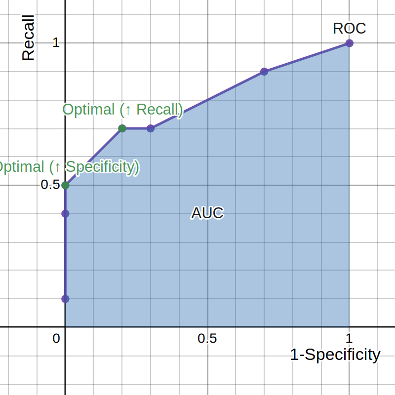

# Dimensions in machine learning

The number of features is equivalent to the number of dimension a model faces

## The curse of dimensionality

This curse indicates that, as the number of dimensions to be analyzed grow, the number of samples needs to grow exponentially to achieve a similar accuracy;

## Curing the curse

To cure this curse, a data analyst can do the following:

- Adding samples to the training set;
- Reduce dimensions of data;
  - Principal Component analysis (PCA): Transforming the original variables into a new set of uncorrelated variables (Principal components);

# Dealing with imbalanced classes in dataset

Imbalanced data is when classes are not represented equality, which alters the classification weighting;

Below are some strategies to avoid imbalanced classes in your dataset:

1. Collecting more data;
2. Changing performance metric;
3. Resampling your data set;
4. Generate syntactic data;
5. Changing predictive algorithms;
6. Penalizing models;
7. Take a different approach to create a new dataset;

# ROC and AUC

